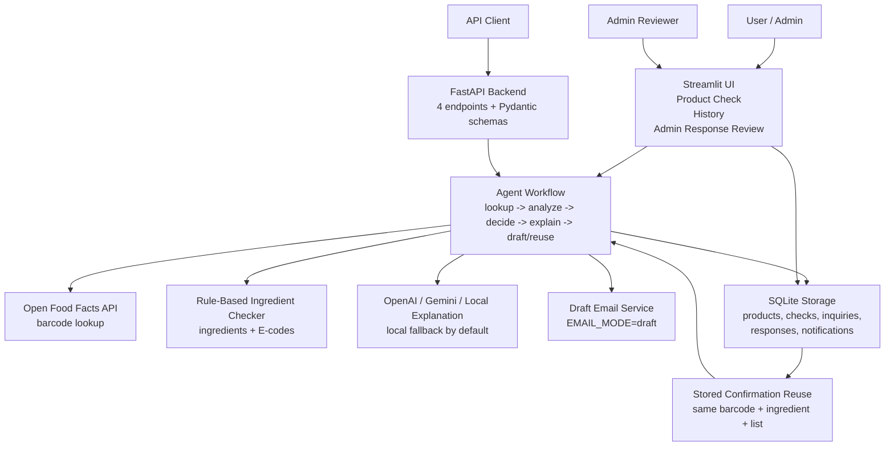

# Architecture

AI HalalCheck Agent is built as a small modular MVP. The same core agent logic
is reused by both the Streamlit UI and the FastAPI backend.

## Architecture Diagram



## Main Components

- `app.py`: Streamlit UI for product checks, history, and admin response
  review.
- `api.py`: FastAPI backend for API access to the product-check workflow.
- `agents.py`: Modular workflow functions for product lookup, ingredient
  analysis, halal decision logic, manufacturer inquiry drafts, response
  analysis, and user communication.
- `halal_rules.py`: Rule-based ingredient and E-code checker.
- `product_lookup.py`: Open Food Facts barcode lookup.
- `database.py`: SQLite schema, database initialization, and seed data loading.
- `rag_engine.py`: Simple keyword-based knowledge retrieval for explanations.
- `email_service.py`: Human-reviewable email draft generation. Real sending is
  disabled by default.
- `config.py`: Environment variable loading from `.env`.

## User Interfaces

The Streamlit UI is the main human-facing workflow. It supports barcode input,
manual product details, ingredient analysis, AI/local explanations, check
history, pending inquiry review, and Admin Response Review. Admin Response
Review lets a reviewer paste a manufacturer reply, store the evidence, update
the inquiry status, and create a draft notification for the user when a user
email is available.

The FastAPI backend exposes the same workflow for programmatic use. It uses
Pydantic request and response schemas to validate inputs and keep API responses
structured.

## FastAPI Endpoints

- `GET /health`: Confirms the backend is running.
- `POST /check-product`: Runs barcode lookup, manual fallback, ingredient
  analysis, decision logic, explanation generation, stored confirmation reuse,
  and manufacturer inquiry draft creation when needed.
- `GET /product-status/{barcode}`: Returns the latest locally known status for
  a barcode.
- `POST /manufacturer-response`: Accepts a manufacturer response, analyzes it,
  stores it in SQLite, updates the inquiry status, and creates a draft user
  notification if a user email exists.

The API uses these Pydantic schemas:

- `ProductCheckRequest`
- `ProductCheckResponse`
- `ManufacturerResponseRequest`
- `ManufacturerResponseResult`

## Agent Workflow

The workflow is intentionally simple for the bootcamp MVP:

- Product lookup agent: uses Open Food Facts for barcode lookup and keeps
  manual input as a fallback.
- Ingredient analysis agent: detects acceptable, doubtful, not-halal, and
  unknown ingredients using explicit rules.
- Decision agent: produces the final status while keeping certification claims
  conservative.
- Communication agent: creates a local explanation by default, with optional
  OpenAI or Gemini support when configured.
- Manufacturer inquiry agent: creates draft emails for doubtful cases and
  prevents duplicate drafts where possible.
- Manufacturer response analyzer: classifies responses, stores confirmation
  evidence, and supports later reuse.

## Data Flow

1. A user enters a barcode or manual product details.
2. The product lookup agent checks local SQLite first and then Open Food Facts
   when a barcode is available.
3. Ingredient rules classify detected ingredients as acceptable, doubtful, not
   halal, or unknown.
4. The decision agent applies final status logic.
5. The communication agent generates a local or optional LLM-assisted
   explanation.
6. If verification is needed, the manufacturer inquiry agent creates or reuses
   a draft inquiry.
7. An admin can paste a manufacturer response through Streamlit or FastAPI.
8. The response is analyzed, stored, and reused later only when the barcode,
   doubtful ingredient, and ingredient list still match.

## Storage And Reuse

SQLite stores products, product checks, manufacturer inquiries, manufacturer
responses, and user notification drafts. Stored manufacturer confirmations are
reused only when the product barcode, doubtful ingredient, and ingredient list
still match. If ingredients change, the app asks for a new review instead of
silently trusting old evidence.

## Email Roles

- System email: `GMAIL_SENDER_EMAIL`, for example `halalcheckde@gmail.com`, is
  the sender and reply inbox for manufacturer inquiries.
- Manufacturer email: `manufacturer_email` is the company recipient for the
  inquiry.
- User email: `user_email` is only used to create a notification draft after a
  manufacturer response is received. It is never used as the sender.
- Gmail reply sync reads replies from the system inbox and stores manufacturer
  responses in SQLite so stored confirmation reuse works for future checks.

## Safety Rules

The system must never mark a product as `Halal Certified` unless an official
halal certificate is available. `Manufacturer Confirmed Suitable` is not the
same as `Halal Certified`.

`EMAIL_MODE=draft` is the default. In the MVP, no real emails are sent by
Streamlit or FastAPI.

## Run Commands

Streamlit:

```bash
py -m streamlit run app.py
```

FastAPI:

```bash
py -m uvicorn api:app --reload
```

FastAPI docs:

```text
http://127.0.0.1:8000/docs
```

Docker Compose:

```bash
docker compose up --build
```

## Metrics

- 48 automated tests passed.
- 6 FastAPI endpoints: 4 core endpoints and 2 optional Gmail workflow endpoints.
- Streamlit UI with Product Check, History, and Admin Response Review pages.
- SQLite workflow for product checks, manufacturer inquiries, responses, and
  notifications.

## Future Extensions

Future versions can add MCP tools, n8n automation, reviewed Gmail sending,
LangGraph agent orchestration, ChromaDB or FAISS retrieval, and cloud
deployment.
